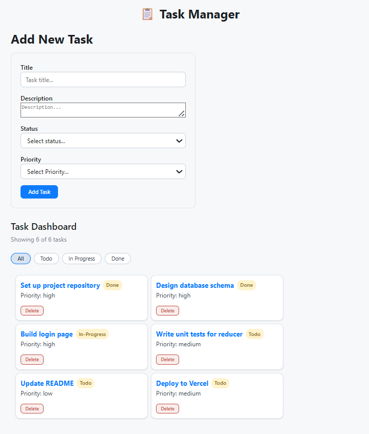

# Task Manager - Module 2 Assignment (React Web)

## Overview

* **Module**: Module 2: Frontend Development (React Web)

* **Type**: Module Assignment

* **Estimated Time**: 2 hours

* **Submission**: GitHub repository link

---

## Learning Objectives

This assignment reinforces the following concepts:

* Managing application state using `useReducer` along with a well-defined set of actions.

* Sharing state and dispatch seamlessly across the component tree via `useContext`.

* Implementing client-side routing utilizing React Router.

---

## Introduction

The Task Manager is a frontend web application where users can view, add, delete, and filter tasks. Application state is completely managed with `useReducer` and shared across components using `useContext`. The app operates with two primary routes: a task list view and a task detail page.

Key features built into this application include:

* A task list page at `/tasks` showing all tasks with their current status and priority.

* A task detail page at `/tasks/:id` showing the full description of a single task.

* A filter bar to narrow down the task list by status.

* A form dedicated to adding new tasks.

* A delete button featured on each task row.

## Part 1: Setup
Create the React Project

```bash
# Create new Vite React project
npm create vite@latest task-manager -- --templatereact

# Navigate into the project
cd task-manager

# Install React Router:
npm install react-router-dom

```


### Ensure Your Servers Are Running
Make sure both your CRM development server and json-server are running in your terminal:

```bash
npm run dev
```

```bash
npm run server
```

## Step 2: Verify Setup

1. Navigate to http://localhost:5173
2. You should see the default Vite React app
3. You're ready to start building!

## Step 3: Understand the Project Structure

```
task-manager/
├── data/
│   └── db.json
└── src/
    ├── components/
    │   ├── AddTaskForm.jsx
    │   ├── FilterBar.jsx
    │   ├── Header.jsx
    │   ├── Header.module.css
    │   └── TaskList.jsx
    ├── context/
    │   └── TaskContext.jsx
    ├── pages/
    │   ├── Task.module.css
    │   ├── TaskDetailPage.jsx
    │   ├── TaskListPage.jsx
    │   └── TaskListPage.module.css
    ├── reducer/
    │   └── taskReducer.js
    └── App.jsx
```

## 📸 Application Screenshot

The screenshot below displays the main task list page, active status filter, task status badges, priority markers, and the integrated task addition form.


## 💡 Bonus Challenges Completed

- Task Count Summary: Displayed a dynamic summary above the list showing "Showing X of Y tasks".  
- Form Validation: Disabled the Add Task form's submit button while any required field is empty.  
- State Persistence: Persisted tasks in localStorage so they survive page reloads using a lazy useState initializer in TaskContext.  
- Task Updates: Added an UPDATE_TASK action and an inline edit form on the detail page.  
- Drag-and-Drop Reordering: Added drag-and-drop reordering of tasks in the list using only native browser drag events (no library)

## 🤖 AI and Tools Usage Note

* **Tools used and purposes:**
  * **AI Assistants (ChatGPT / Gemini / Copilot): Used to help understand state reducer patterns, debug routing errors, and structure project documentation.  
  * **Vite & React:** Used as the core framework and build tool for scaffolding and developing the application.
  * **React Router DOM:** Used for implementing client-side routing and navigation.

* **Code adapted from external sources:**
  * [React docs: Extracting State Logic into a Reducer](https://react.dev/learn/extracting-state-logic-into-a-reducer)
  * [React docs: Passing Data Deeply with Context](https://react.dev/learn/passing-data-deeply-with-context)
  * [React docs: Scaling Up with Reducer and Context](https://react.dev/learn/scaling-up-with-reducer-and-context)
  * [React Router docs](https://reactrouter.com/)